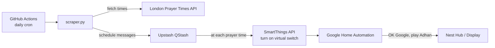

# prayer-times-scheduler

Automatically plays the Adhan (call to prayer) on a Google Nest Hub at each prayer time, based on daily prayer times fetched from the [London Prayer Times API](https://www.londonprayertimes.com/).

## How it works



1. A GitHub Actions workflow runs [scraper.py](scraper.py) once a day.
2. The script fetches that day's prayer times (Fajr, Zuhr, Asr, Maghrib, Isha) from the London Prayer Times API.
3. For each upcoming prayer time, it schedules a delayed message with [Upstash QStash](https://upstash.com/docs/qstash) that calls the SmartThings API to turn on a virtual switch ("Youtube Trigger") at the exact prayer time.
4. Turning on that virtual switch fires a Google Home automation ([.google.home.automation/youtube-trigger.yml](.google.home.automation/youtube-trigger.yml)) which mutes the display, asks the Google Assistant to play the Adhan playlist on YouTube, waits, then unmutes and resets the switch.

## Project structure

| File | Purpose |
|---|---|
| [scraper.py](scraper.py) | Fetches prayer times and schedules SmartThings triggers via QStash |
| [.github/workflows/schedule.yml](.github/workflows/schedule.yml) | GitHub Actions workflow that runs the scraper daily |
| [.google.home.automation/youtube-trigger.yml](.google.home.automation/youtube-trigger.yml) | Google Home automation that plays the Adhan when the virtual switch turns on |

## Setup

### Prerequisites

- A [London Prayer Times API](https://www.londonprayertimes.com/api/) key
- An [Upstash QStash](https://upstash.com/docs/qstash) account and token
- A Samsung SmartThings account with a virtual switch device and a [personal access token](https://account.smartthings.com/tokens)
- A Google Home automation configured to trigger off that virtual switch (see [.google.home.automation/youtube-trigger.yml](.google.home.automation/youtube-trigger.yml))

### Configuration

The workflow expects the following repository secrets/variables (set under the `PROD` environment):

| Name | Type | Description |
|---|---|---|
| `LPT_API_KEY` | secret | London Prayer Times API key |
| `QSTASH_TOKEN` | secret | Upstash QStash API token |
| `QSTASH_URL` | variable | Upstash QStash base URL |
| `SMARTTHINGS_TOKEN` | secret | SmartThings personal access token |
| `DEVICE_ID` | secret | SmartThings virtual switch device ID |

### Running locally

```bash
pip install requests qstash pytz

export LPT_API_KEY=...
export QSTASH_TOKEN=...
export QSTASH_URL=...
export SMARTTHINGS_TOKEN=...
export DEVICE_ID=...

python scraper.py
```

### Schedule

The GitHub Actions workflow runs daily at 02:00 UTC (see the `cron` schedule in [.github/workflows/schedule.yml](.github/workflows/schedule.yml)) and can also be triggered manually via `workflow_dispatch`.