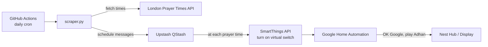

# prayer-times-scheduler

Automatically plays the Adhan (call to prayer) on a Google Nest Hub at each prayer time, based on daily prayer times fetched from the [London Prayer Times API](https://www.londonprayertimes.com/).

## How it works



1. A GitHub Actions workflow runs [scraper.py](scraper.py) once a day.
2. The script fetches that day's prayer times (Fajr, Zuhr, Asr, Maghrib, Isha) from the London Prayer Times API.
3. For each upcoming prayer time, it schedules a delayed message with [Upstash QStash](https://upstash.com/docs/qstash) that calls the SmartThings API to turn on a virtual switch ("Youtube Trigger") at the exact prayer time.
4. Turning on that virtual switch fires a Google Home automation ([.google.home.automation/youtube-trigger.yml](.google.home.automation/youtube-trigger.yml)) which mutes the display, asks the Google Assistant to play the Adhan playlist on YouTube, waits, then unmutes and resets the switch.

## Project structure

| File | Purpose |
|---|---|
| [scraper.py](scraper.py) | Fetches prayer times and schedules SmartThings triggers via QStash |
| [.github/workflows/schedule.yml](.github/workflows/schedule.yml) | GitHub Actions workflow that runs the scraper daily |
| [.google.home.automation/youtube-trigger.yml](.google.home.automation/youtube-trigger.yml) | Google Home automation that plays the Adhan when the virtual switch turns on |

## Setup

### Prerequisites

- A [London Prayer Times API](https://www.londonprayertimes.com/api/) key
- An [Upstash QStash](https://upstash.com/docs/qstash) account and token
- A Samsung SmartThings account with a virtual switch device and an OAuth-connected SmartApp (client ID, client secret and refresh token — see [Getting SmartThings API access](#getting-smartthings-api-access) below)
- A Google Home automation configured to trigger off that virtual switch (see [.google.home.automation/youtube-trigger.yml](.google.home.automation/youtube-trigger.yml))

### Configuration

The workflow expects the following repository secrets/variables (set under the `PROD` environment):

| Name | Type | Description |
|---|---|---|
| `LPT_API_KEY` | secret | London Prayer Times API key |
| `QSTASH_TOKEN` | secret | Upstash QStash API token |
| `QSTASH_URL` | variable | Upstash QStash base URL |
| `ST_CLIENT_ID` | secret | SmartThings OAuth SmartApp client ID |
| `ST_CLIENT_SECRET` | secret | SmartThings OAuth SmartApp client secret |
| `ST_REFRESH_TOKEN` | secret | SmartThings OAuth refresh token |
| `DEVICE_ID` | secret | SmartThings virtual switch device ID |

### Getting SmartThings API access

SmartThings [personal access tokens](https://account.smartthings.com/tokens) expire after 24 hours, so this project instead uses an OAuth-connected SmartApp, which issues a long-lived refresh token that [scraper.py](scraper.py) exchanges for a fresh access token on every run.

1. Create a virtual switch device in the SmartThings app (this is the device the automation triggers off).
2. In the [SmartThings Developer Workspace](https://smartthings.developer.samsung.com/workspace/), create a new project and register a SmartApp with OAuth enabled, requesting the `r:devices:*` and `x:devices:*` scopes so it can read and control your virtual switch.
3. Note the generated **Client ID** and **Client Secret** — these become `ST_CLIENT_ID` and `ST_CLIENT_SECRET`.
4. Perform the OAuth2 authorization code flow once, manually, to obtain an initial refresh token:
   - Open `https://api.smartthings.com/oauth/authorize?client_id=<ST_CLIENT_ID>&response_type=code&scope=r:devices:* x:devices:*&redirect_uri=<your redirect URI>` in a browser, log in and approve access.
   - SmartThings redirects to your `redirect_uri` with a `?code=...` query parameter — copy that code.
   - Exchange the code for tokens:
     ```bash
     curl -X POST https://api.smartthings.com/oauth/token \
       -H "Authorization: Basic $(echo -n '<ST_CLIENT_ID>:<ST_CLIENT_SECRET>' | base64)" \
       -d grant_type=authorization_code \
       -d code=<code> \
       -d client_id=<ST_CLIENT_ID> \
       -d redirect_uri=<your redirect URI>
     ```
   - Save the `refresh_token` from the response as `ST_REFRESH_TOKEN`.
5. SmartThings may rotate the refresh token on each use; `scraper.py` logs the new value when this happens, so update the `ST_REFRESH_TOKEN` secret periodically to avoid it going stale.

### Running locally

```bash
pip install requests qstash pytz

export LPT_API_KEY=...
export QSTASH_TOKEN=...
export QSTASH_URL=...
export ST_CLIENT_ID=...
export ST_CLIENT_SECRET=...
export ST_REFRESH_TOKEN=...
export DEVICE_ID=...

python scraper.py
```

### Schedule

The GitHub Actions workflow runs daily at 02:00 UTC (see the `cron` schedule in [.github/workflows/schedule.yml](.github/workflows/schedule.yml)) and can also be triggered manually via `workflow_dispatch`.